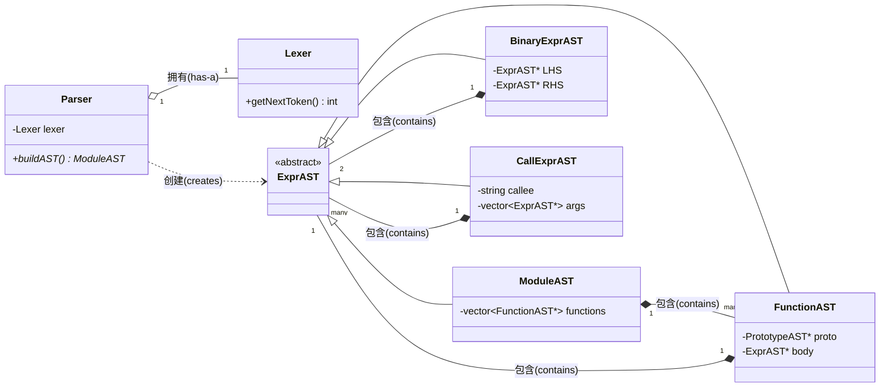

#### 图2：核心C++类关系

```mermaid
classDiagram
    direction LR

    class Parser {
        -Lexer lexer
        +buildAST() ModuleAST*
    }

    class Lexer {
        +getNextToken() int
    }

    class ExprAST {
        <<abstract>>
    }

    class ModuleAST {
        -vector~FunctionAST*~ functions
    }

    class FunctionAST {
        -PrototypeAST* proto
        -ExprAST* body
    }

    class BinaryExprAST {
        -ExprAST* LHS
        -ExprAST* RHS
    }

    class CallExprAST {
        -string callee
        -vector~ExprAST*~ args
    }

    Parser "1" o-- "1" Lexer : 拥有(has-a)
    Parser..> ExprAST : 创建(creates)


    ExprAST <|-- FunctionAST
    ExprAST <|-- BinaryExprAST
    ExprAST <|-- CallExprAST
    ExprAST <|-- ModuleAST

    ModuleAST "1" *-- "many" FunctionAST : 包含(contains)
    FunctionAST "1" *-- "1" ExprAST : 包含(contains)
    BinaryExprAST "1" *-- "2" ExprAST : 包含(contains)
    CallExprAST "1" *-- "many" ExprAST : 包含(contains)
```
