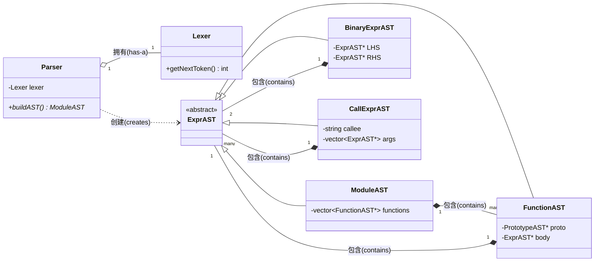

#### 图2：核心C++类关系

## Lexer(词法分析器)

`Lexer` 的职责是将源代码文本流分解为独立的“令牌”（Token）。它像一个传送带，为 `Parser`提供原材料 ^^。**   **

| 类    | 关键成员                        | 作用                                                                                                                                                    |
| ----- | ------------------------------- | ------------------------------------------------------------------------------------------------------------------------------------------------------- |
| Lexer | `Lexer(std::string filename)` | **构造函数** ：接收源文件名，打开并读取文件内容到内存缓冲区中，为词法分析做准备。                                                                 |
|       | `int getNextToken()`          | **核心公共接口** ：这是 `Parser`调用的主要函数。它通过调用内部的 `gettok()`来获取下一个令牌，并将其存储在 `CurTok`中（在 `Parser`类中）。 |
|       | `std::string IdentifierStr`   | **成员变量** ：如果当前令牌是一个标识符（如变量名或函数名），这个字符串会存储该标识符的文本。                                                     |
|       | `double NumVal`               | **成员变量** ：如果当前令牌是一个数字，这个变量会存储其浮点数值。                                                                                 |
|       | `int LastChar`                | **成员变量** ：存储从源文件中读取的最后一个字符，作为内部状态。                                                                                   |
|       | `int gettok()`                | **内部辅助函数** ：执行实际的词法分析工作。它逐字符扫描输入，跳过空格和注释，然后识别并返回下一个令牌的枚举值。                                   |

## AST抽象语法树

这些类是程序在内存中的结构化表示。它们主要是数据容器，其成员变量在 `Parser`创建它们时通过构造函数进行初始化 。

| 类/结构体                     | 作用与关键成员                                                                                                                                                       |
| ----------------------------- | -------------------------------------------------------------------------------------------------------------------------------------------------------------------- |
| **`ExprAST`**         | **抽象基类** ：所有表达式节点的父类。它定义了所有节点共有的接口（如虚析构函数），使得可以用 `ExprAST*`指针来表示任意类型的表达式节点，从而构建多态的树结构。 |
| **`NumberExprAST`**   | 存储一个浮点数值（`double Val`）。                                                                                                                                 |
| **`LiteralExprAST`**  | 存储一个张量字面量，包括其值（`std::vector<double> Vals`）和形状（`std::vector<int64_t> Dims`）。                                                                |
| **`VariableExprAST`** | 存储一个变量的名称（`std::string Name`）。                                                                                                                         |
| **`ReturnExprAST`**   | 代表一个 `return`语句。它可能包含一个指向要返回的表达式的 `std::unique_ptr<ExprAST> Expr`。                                                                      |
| **`BinaryExprAST`**   | 代表一个二元运算（如 `a + b`）。存储操作符（`char Op`）以及指向左右两个操作数（LHS/RHS）的 `std::unique_ptr<ExprAST>`。                                        |
| **`CallExprAST`**     | 代表一个函数调用。存储被调用函数的名称（`std::string Callee`）和一个 `std::vector<std::unique_ptr<ExprAST>>`，用于存放所有参数表达式。                           |
| **`PrototypeAST`**    | 代表一个函数的“签名”或“原型”。存储函数的名称（`std::string Name`）和其参数名称列表（`std::vector<std::unique_ptr<VariableExprAST>>`）。                      |
| **`FunctionAST`**     | 代表一个完整的函数定义。它拥有一个函数签名（`std::unique_ptr<PrototypeAST> Proto`）和一个指向函数体的 `std::unique_ptr<ExprAST>`。                               |
| **`VarDeclExprAST`**  | 代表一个 `var`变量声明。存储变量名（`std::string Name`）、类型（`VarType Type`）以及一个指向其初始化表达式的 `std::unique_ptr<ExprAST>`。                    |
| **`VarType`**         | 一个简单的结构体，用于存储变量的形状信息（`std::vector<int64_t> Shape`）。                                                                                         |
| **`ModuleAST`**       | **AST的根节点** 。代表整个源文件/模块，内部持有一个 `std::vector<FunctionAST>`，用于存储文件中的所有函数。                                                   |

## Parser (语法分析器)

`Parser`是前端的“指挥官”，它采用**递归下降**的策略，通过一系列 `parse...`函数来构建AST 。

| 类                   | 关键成员                                                                               | 作用                                                                                                                                                                                          |
| -------------------- | -------------------------------------------------------------------------------------- | --------------------------------------------------------------------------------------------------------------------------------------------------------------------------------------------- |
| **`Parser`** | `Parser(Lexer &lexer)`                                                               | **构造函数** ：接收一个 `Lexer`的引用，并调用 `getNextToken()`来预加载第一个令牌。                                                                                                  |
|                      | `int CurTok`                                                                         | **成员变量** ：存储由 `Lexer`提供的当前令牌。                                                                                                                                         |
|                      | `int getNextToken()`                                                                 | **辅助函数** ：简单地调用 `lexer.getNextToken()`来更新 `CurTok`，使解析器前进到下一个令牌。                                                                                         |
|                      | `std::map<char, int> BinopPrecedence`                                                | **成员变量** ：一个映射表，用于存储二元运算符的优先级。例如，`BinopPrecedence['*'] = 20; BinopPrecedence['+'] = 10;`。                                                                |
|                      | `int getTokPrecedence()`                                                             | **辅助函数** ：查询 `BinopPrecedence`映射，返回当前令牌（如果它是二元运算符）的优先级。                                                                                               |
|                      | `std::unique_ptr<ModuleAST> parseModule()`                                           | **顶层入口** ：开始整个解析过程，循环调用 `parseDefinition()`和 `parseTopLevelExpr()`来解析文件中的所有函数和顶层表达式，并返回构建好的 `ModuleAST`根节点。                       |
|                      | `std::unique_ptr<FunctionAST> parseDefinition()`                                     | 解析一个完整的函数定义，从 `def`关键字开始，到整个函数体结束。                                                                                                                              |
|                      | `std::unique_ptr<ExprAST> parseTopLevelExpr()`                                       | 解析一个顶层表达式（即不在任何函数内部的表达式），这主要用于交互式的JIT场景。                                                                                                                 |
|                      | `std::unique_ptr<PrototypeAST> parsePrototype()`                                     | 解析函数的签名部分，即 `my_func(a, b)`。                                                                                                                                                    |
|                      | `std::unique_ptr<ExprAST> parseExpression()`                                         | 解析一个完整的表达式。它首先调用 `parsePrimary()`来处理基础部分，然后循环调用 `parseBinOpRHS()`来处理所有二元运算符。                                                                     |
|                      | `std::unique_ptr<ExprAST> parsePrimary()`                                            | 解析表达式中最基本的单元，是递归的基准情况。它会根据当前令牌分派到其他 `parse...`函数，如 `parseNumberExpr`、`parseIdentifierExpr`等。                                                  |
|                      | `std::unique_ptr<ExprAST> parseIdentifierExpr()`                                     | 解析一个以标识符开头的表达式。它需要判断这个标识符是一个简单的变量引用，还是一个函数调用（后面跟着 `(`）。                                                                                  |
|                      | `std::unique_ptr<ExprAST> parseNumberExpr()`                                         | 解析一个数字字面量，并创建一个 `NumberExprAST`节点。                                                                                                                                        |
|                      | `std::unique_ptr<ExprAST> parseTensorLiteral()`                                      | 解析一个张量字面量，如 `[[2, 3], [4, 5]]`，并创建一个 `LiteralExprAST`节点。                                                                                                              |
|                      | `std::unique_ptr<ExprAST> parseParenExpr()`                                          | 解析一个用括号 `()`包围的表达式。                                                                                                                                                           |
|                      | `std::unique_ptr<ExprAST> parseVarDecl()`                                            | 解析一个 `var`变量声明语句，并创建一个 `VarDeclExprAST`节点。                                                                                                                             |
|                      | `std::unique_ptr<ExprAST> parseBinOpRHS(int ExprPrec, std::unique_ptr<ExprAST> LHS)` | **处理操作符优先级的核心** ：这是一个递归函数，用于处理二元运算符的右侧。它通过比较当前运算符和上一个运算符的优先级，来正确地构建表达式树，确保 `a + b * c`被解析为 `a + (b * c)`。 |

Export to Sheets

** Sources and related content **

